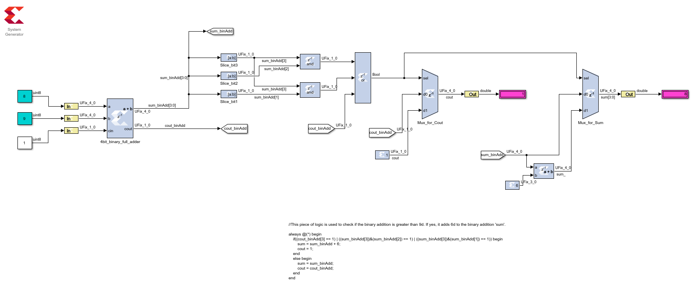

#### One digit BCD adder implementation in Xilinx System Generator

Work in progress..  

This repo contains XSG Simulink model for 1 digit BCD adder.  
Equivalent handwritten HDL implementation can be found below.  
https://github.com/kambadur/Projects/tree/main/bcdadder  

The goal is to verify both the implementations in Vivado (for learning purposes)  

##### XSG blocks used in this model:  
AddSub  
Slice  
Logical  
Relational  
Constant  
Mux  
Gatway In/Out  

Simulation, Compilation and Generation of netlist needs to be vrified yet. After this it has to be tested in Vivado to see if the HDL wrapper that XSG generates synthesizes.  
   

Notes:  
I have noticed Solver configuration and 'Simulink system period' parameter from System Generator token are not very important in this combinational circuit.  So, I left it as 1s as shown below.

I found Simulink compiler didnot complain if I treat 1bit values as UFix_1_0 (unsigned fixed-point 1bit 0bits after decimal point arithmetic) instead of boolean. Please see below.  

  

At this point in time, I am still not very comfortable implementing my design in XSG. I find it easier and faster to do this in verilog and simulate it in iVerilog and GTKwave. Perhaps this might change once I get myself little more familiar with XSG and Simulink in general.  

##### Useful resources:  
http://www.ece.northwestern.edu/local-apps/matlabhelp/toolbox/simulink/slref/bitwiselogicaloperator.html  
https://hdlbits.01xz.net/wiki/Bcdadd4  
