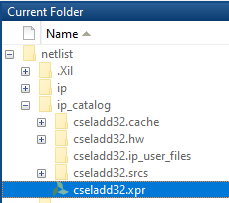
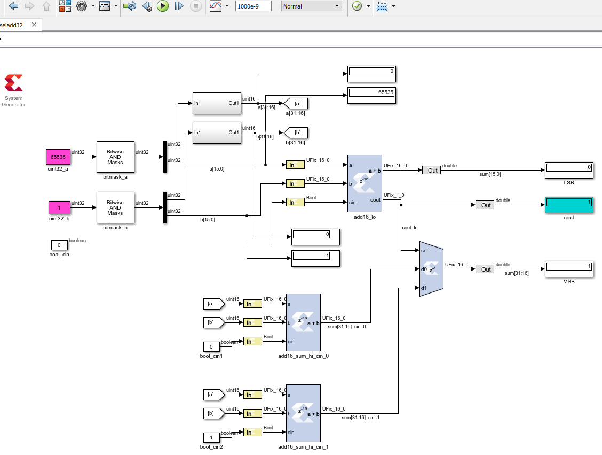

#### HDLBits example: Carry select adder implemeneted in Xilinx System Generator
[Module Cseladd: ](https://hdlbits.01xz.net/wiki/Module_cseladd)  
This repo contains XSG Simulink model for carry select adder example from HDLBits.  
I used simulink standard blocks to extract upper and lower halves of 32bit input operands for a[31:0] and b[31:0]. Later I came to know that there is a built-in block in simulink that can take care of this. It is called 'Extract Bits' located in 'Logic and Bit operations'.  
Compilation and Generation of netlist from XSG works without errors. The project can be opened in Vivado by double clicking .xpr as shown.    
   
The model is simulated only in Simulink. I have not tested it yet in Vivado to see if the HDL wrapper that XSG generates synthesizes.  
